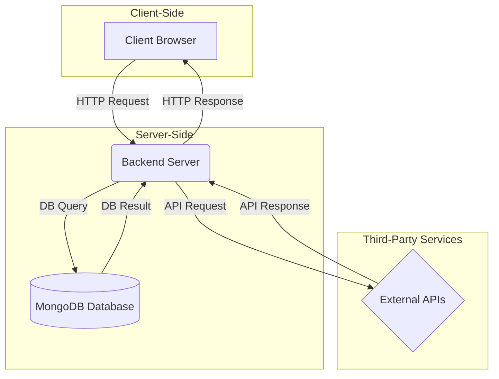

 # Smart Travel & Safety Dashboard

[](https://www.repostatus.org/#active)

A web-based dashboard that provides travelers with real-time, consolidated information for safe and efficient journey planning.

<!-- 
**Live Demo:** [Link to your live demo here!]
-->

## Table of Contents
1.  [Features](#1-features)
2.  [Introduction](#2-introduction)
3.  [Objectives](#3-objectives)
4.  [System Architecture](#4-system-architecture)
5.  [Public APIs Used](#5-public-apis-used)
6.  [Client-Side Implementation](#6-client-side-implementation)
7.  [Backend (Web Service) Implementation](#7-backend-web-service-implementation)
8.  [Security Implementation](#8-security-implementation)
9.  [Testing and Evaluation](#9-testing-and-evaluation)
10. [Results](#10-results)
11. [Challenges and Limitations](#11-challenges-and-limitations)
12. [Conclusion](#12-conclusion)
13. [Project Setup](#13-project-setup)

## 1. Features
*   **Real-time Weather Data:** Get current weather conditions for any location.
*   **Points of Interest:** Discover nearby places like restaurants, tourist spots, and essential services.
*   **Aggregated Dashboard:** View all critical travel information on a single, user-friendly interface.
*   **Secure API Handling:** All API keys are securely managed on the backend, never exposed to the client.

## 2. Introduction

### 2.1 Background of the Project
In an increasingly interconnected world, travelers seek comprehensive and up-to-date information to plan their journeys effectively. Accessing scattered data from various sources—such as weather forecasts, local points of interest, and safety advisories—can be time-consuming and inefficient. The Smart Travel & Safety Dashboard project was initiated to address this challenge by creating a unified platform that aggregates critical travel-related data into a single, intuitive interface. This system aims to enhance the travel planning experience by providing relevant, real-time information, thereby empowering travelers to make informed and safer decisions.

### 2.2 Purpose of the System
The primary purpose of this system is to develop a client-server application that serves as a "Smart Travel & Safety Dashboard." The system fetches data from multiple public APIs, processes it, and presents it to the user in an aggregated and easily digestible format. By centralizing information on weather, nearby amenities, and safety, the dashboard helps users assess travel conditions and plan their activities more efficiently.

### 2.3 Overview of the Client–Server Architecture
The system is built on a standard client-server architecture. The client-side is a web-based interface that allows users to input their travel queries. The server-side, a backend web service, receives these requests, communicates with various external public APIs to gather the necessary data, and may cache or store results in a MongoDB database. The processed information is then sent back to the client for display. This decoupled architecture ensures a clear separation of concerns between the user interface and the core business logic.

## 3. Objectives

### 3.1 General Objective
The overarching goal of this project is to design, develop, and implement a functional Smart Travel & Safety Dashboard that provides users with integrated, real-time data from various sources to facilitate safer and more organized travel planning.

### 3.2 Specific Objectives
*   To integrate at least two public APIs to fetch real-time data related to weather and points of interest.
*   To develop a responsive and intuitive client-side user interface using HTML, CSS, and JavaScript.
*   To implement a robust server-side web service using Node.js and Express.js to handle API requests and data aggregation.
*   To utilize a MongoDB database for storing or caching relevant travel data.
*   To implement essential security measures, such as API key protection, to ensure secure data handling.
*   To test the system's functionality, including API endpoints and data flow, using tools like Postman.

## 4. System Architecture

### 4.1 High-Level Architecture Diagram


### 5.2 System Components
*   **Client (Frontend)**: A web application built with HTML, CSS, and JavaScript. It is responsible for rendering the user interface, capturing user input (e.g., location), and displaying the aggregated data received from the backend.
*   **Backend (Web Service)**: A Node.js application using the Express.js framework. It exposes API endpoints to the client, handles incoming requests, fetches data from external APIs, performs data processing, and interacts with the MongoDB database.
*   **Database**: A MongoDB NoSQL database used for storing cached API responses or user-specific data. This helps reduce latency and avoids hitting API rate limits.
*   **External Public APIs**: Third-party services that provide the core data for the dashboard, such as weather conditions and local points of interest.

### 5.3 Data Flow Explanation
The data flow begins when a user interacts with the client-side interface, for instance, by entering a location. The client sends an HTTP request to a specific endpoint on the backend server. The server receives this request and invokes functions to query the necessary external APIs (e.g., OpenWeatherMap for weather, Geoapify for places). The server may also query its MongoDB database to check for cached data. Once the data is retrieved, the backend aggregates and formats it into a structured JSON object, which is then sent back to the client as the HTTP response. Finally, the client-side JavaScript parses this response and dynamically updates the UI to display the information.

## 6. Public APIs Used

The dashboard integrates data from several public APIs to provide a comprehensive travel overview. The following sections detail the APIs used in this project.

### 6.1 OpenWeatherMap API

#### 6.1.1 API Description
The OpenWeatherMap API provides access to current weather data, forecasts, and historical weather information for any geographical location. It is used in this project to fetch real-time weather conditions for the user's specified location.

#### 6.1.2 API Documentation Link
*   [https://openweathermap.org/api](https://openweathermap.org/api)

#### 6.1.3 Sample API Response
```json
{
  "coord": { "lon": -0.1257, "lat": 51.5085 },
  "weather": [
    {
      "id": 801,
      "main": "Clouds",
      "description": "few clouds",
      "icon": "02d"
    }
  ],
  "main": {
    "temp": 288.71,
    "feels_like": 288.21,
    "temp_min": 287.59,
    "temp_max": 289.82,
    "pressure": 1012,
    "humidity": 76
  },
  "wind": { "speed": 4.12, "deg": 240 },
  "dt": 1661870592,
  "sys": { "country": "GB", "sunrise": 1661834129, "sunset": 1661882417 },
  "name": "London"
}
```

#### 6.1.4 Extracted Data Fields
*   `weather[0].description`: The textual description of the weather.
*   `main.temp`: The current temperature.
*   `main.humidity`: The current humidity level.
*   `wind.speed`: The current wind speed.
*   `name`: The name of the location.

### 6.2 Geoapify Places API

#### 6.2.1 API Description
The Geoapify Places API allows for querying points of interest (POIs) within a specified area. This is used to find nearby amenities such as restaurants, tourist attractions, and hospitals, providing travelers with valuable local context.

#### 6.2.2 API Documentation Link
*   https://www.geoapify.com/places-api

#### 6.2.3 Sample API Response
```json
{
  "type": "FeatureCollection",
  "features": [
    {
      "type": "Feature",
      "properties": {
        "name": "British Museum",
        "country": "United Kingdom",
        "postcode": "WC1B 3DG",
        "city": "London",
        "address_line1": "British Museum",
        "address_line2": "Great Russell Street, London, WC1B 3DG",
        "categories": ["entertainment.museum"],
        "distance": 130
      },
      "geometry": {
        "type": "Point",
        "coordinates": [-0.1269702, 51.5194265]
      }
    }
  ]
}
```

#### 6.2.4 Extracted Data Fields
*   `properties.name`: The name of the place.
*   `properties.categories`: The categories the place belongs to.
*   `properties.address_line2`: The full address of the place.
*   `properties.distance`: The distance from the search center.

## 7. Client-Side Implementation
*(This section should be filled with details specific to your project's frontend.)*

## 8. Backend (Web Service) Implementation
*(This section should be filled with details specific to your project's backend.)*

## 9. Security Implementation

Security is a critical aspect of the system, particularly as it handles API keys and transmits data over the network. The following measures were implemented.

### 10.1 API Security Measures
To prevent exposure of sensitive API keys on the client-side, all external API calls are routed through the backend server. API keys are stored securely on the server as environment variables and are never hardcoded into the source code. This practice follows the principle of keeping secrets out of the version control system and client-side code.

### 10.2 Code Snippets of Security Implementations
The `dotenv` library is used to manage environment variables in the Node.js backend.

**Loading environment variables:**
```javascript
// In the main server file (e.g., index.js)
require('dotenv').config();

const openWeatherApiKey = process.env.OPENWEATHER_API_KEY;
```

**`.env` file (This file should be added to `.gitignore`):**
```
# .env
OPENWEATHER_API_KEY="your_actual_api_key_here"
GEOAPIFY_API_KEY="your_actual_api_key_here"
```

## 10. Testing and Evaluation
*(This section should be filled with screenshots and results from your testing.)*

## 11. Results
*(This section should be filled with final outputs and screenshots.)*

## 12. Challenges and Limitations
*(This section should be filled with challenges you faced and limitations of the system.)*

## 13. Conclusion
*(This section should summarize your work and learnings.)*

## 15. Project files and Video Demonstration

### 15.1 Project Setup Instructions

To set up and run this project on a local machine, please follow these instructions.

**Prerequisites:**
*   Node.js (v16 or later)
*   MongoDB
*   A modern web browser (e.g., Chrome, Firefox)

**Setup Steps:**
1.  **Clone the repository:**
    ```bash
    git clone https://github.com/your-username/smart-travel-dashboard.git
    cd smart-travel-dashboard
    ```

2.  **Install backend dependencies:**
    ```bash
    cd server # or your backend folder
    npm install
    ```

3.  **Create a `.env` file** in the backend directory and add your API keys:
    ```
    MONGO_URI="your_mongodb_connection_string"
    OPENWEATHER_API_KEY="your_openweathermap_api_key"
    GEOAPIFY_API_KEY="your_geoapify_api_key"
    ```

4.  **Install client-side dependencies** (if any):
    ```bash
    cd ../client # or your frontend folder
    # If you are using a framework, run its install command, e.g., npm install
    ```

5.  **Start the backend server:**
    ```bash
    cd ../server
    npm start
    ```

6.  **Open the client application:**
    Open the `index.html` file in your browser or start the client development server if you are using a framework.
